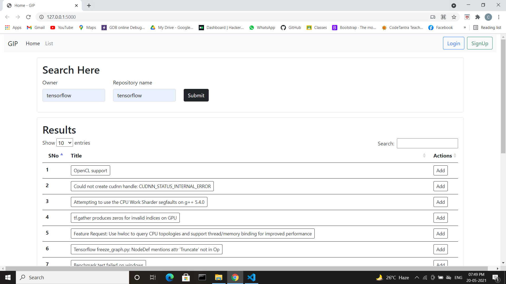

# A Tool to categorize and prioritize github issues
## Motivation
- Most of the github repositories have a huge number of issues which makes it difficult for the software developers and owners of the repository  to find issues that need to be addressed immediately.

- This workload can be reduced by dividing the issues into categories namely development, security, documentation and few others.

- Along with categorizing, prioritizing the issues in those categories would make the work easier.

## How to prioritize ?
- assign weightage to the issues.

- based on their importance like - security related issues > bugs > enhancement > documentation > question > others

- choose some criteria to increase their weitages, they can be

- un-assigned issues > assigned issues

- based on author association (owner > member > collaborator > contributor)

- based on discussion on issues (number of comments)

## Work done
### we had made an attempt in order to prioritize tensorflow issues
- in tensorflow we have mainly six categories - bugs, docs-bug, feature, build/install, performance and support.
- we also have some unlabeled issues for which we can predict a label out of above six labels.
- for this we have used naive-bayes classifier and trained it based on closed issues of tensorflow.
- till this step every issue got an label so now we can put them in six categories.
- we have put them in order and for the same we had assigned some weitage to each issue
 bugs (0.5) > features(0.4) > build/install(0.3) > docs-bug(0.2) > performance(0.1) > support(0.0)
- now these weitage can be increased on different criteria, we had took some
- we had kept unassigned issues first, so thse issues can be assigned to someone because no one is working on them before.
- we can increased some weitage based on amount of conversation, if number of comment are increasing rapidly then it can be a savere issue and contributors are not able to resolve it.
- eventhough anyone can create issues on github, they can be easy to resolve or hard but we have give some weitage based on author association also.

## How to run
- clone the repository in your local system
- open terminal in GIP folder
- make sure you have installed python3 and pip in your system
- install dependencies `pip install -r requirements.txt`
- and run -         `python .\app.py`
- install dependencies if showing error for any (pip install flask, flask_sqlalchemy, requests, sklearn, pandas)
- ctrl+click on the link or open port 5000 in browser
## Alternate
- one recommended way of installing packages in virtual environment for this install virtualenv by
- `pip install virtualenv`
- run `virtualenv env`
- run `.\env\Scripts\activate.ps1`
- if any error in window then run in powershell `Set-ExecutionPolicy unrestricted` and press A

## Screenshots

- This is the result for open issues of tensorflow repository fetched by git-api
- First diagram shows, accuracy of prediction, by comparing real label of an issue by their predicing label
- Second diagram shows, for how many issues we have predicted labels
- Third diagram shows, how many issues are in each category
- Table contains all the issues in descending order of their relavent weitage
- whenever user will click on any issue, he will be redirected to, on the same issue on github repo page.
- optional but if user want to refer some issues later, then he can save them in his list, just need to login for that.

## Problems
- There are many labels with different names on github repositories.
  Tensorflow - 96,  Bootstrap - 52, Scikit-learn - 73 
- Since we can not use only one repositoy data for predicting label of other repository data, It makes difficult to relate all of them.
- We can ask user to give preference which type of issues he want to keep first, but again not every label show their issue type so we can not show all.
- criteria on which we are incrementing weitage of issues, they can be according to user or not.

## Tool video
- Find the [video](https://drive.google.com/file/d/1UrgXqLrCuuYPK8iaP8KiGOF9rTSW975E/view?usp=sharing) for more details
